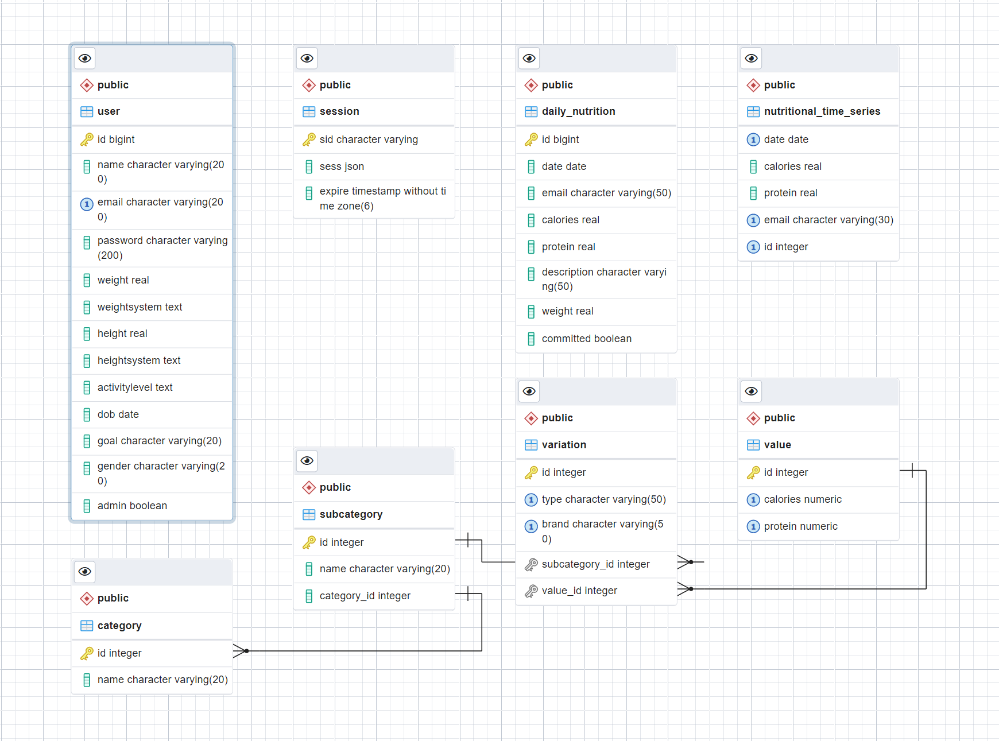

# ProteinAdmin (https://protein-admin.herokuapp.com/)
The app is currently deployed on Heroku. To open it, please click on the heading or find it at the following URL:  
**https://protein-admin.herokuapp.com/**

***

# Project Overview
ProteinAdmin is a nutritional tracker that is comprised of a React + Redux front-end, an Express.js server and a PostgreSQL database. It is the largest undertaking as part of my efforts to put together a comprehensive portfolio of projects to aid me on my initial search for employment as a web developer. Moreover, this application is being developed continuously as a utility for personal usage. The intention is for it to serve practical purposes beyond the needs of the recruitment process.   

***

# Project Development Status
The app is currently in development. While the features planned have been implemented, it has not been thoroughly tested, only to an extent that would assist in informing prospective employers' idea of my familiarity with automated testing. The UI design is also subject to further iteration. 

***

# Database Schema

***

# In-app images

***

# Local Installation and Usage
The most recent version will always be available on Heroku at the link above, but if you would like to run or review the project locally, please follow the steps below:  

1. Clone this repository. *node*, *npm*, and *postgres* global installations are required
2. Install dependencies with *npm install* within the project's root directory ('proteinadmin')
3. The database SQL dump can be found under Backend/DB. Run the following command in the terminal to build the schema: *psql -U db_user db_name < dump_name.sql*
4. Run the app with *npm start* (it will take care of concurrently running the Express server as well as the one that provides the HTML template along with the React logic on startup)
5. View the app at *http://localhost:3000/*

***

# Environmental Variables
## The application needs the following environmental variables to function:
1. ./.env
    - REACT_APP_BACKEND_URL (by default - 'http://localhost:4000')

2. Backend/.env
    - REACT_APP_DB_USER (the default 'postgres' is the owner as per the DB dump)
    - REACT_APP_DB_PASSWORD
    - REACT_APP_DB_HOST (localhost)
    - REACT_APP_DB_PORT
    - REACT_APP_DB_DATABASE (database name)
    - REACT_APP_SESSION_SECRET

***

# Current Features
## The project aims to facilitate keeping track of calorie and protein intake on a daily basis, which can otherwise prove rather time-consuming. Below is a summary of its core features:

- Upon receiving the necessary data on sign-up, it estimates recommended target values for daily and monthly protein and calorie intake. These are dependent upon the physical characteristics of the user, such as weight, height, gender etc., as well as their general level of physical activity.
- The aforementioned target amounts are then set as a reference point against which the user's actual consumed quantities will be compared. Information as to how the user has been doing is presented in two general manners:
    -The two flip cards on the right-hand side of the screen. By default, they show a simplified view of just how many out of the required calories/protein have been consumed thus far. Clicking on them, however, makes them flip and reveals a more comprehensive breakdown, including data like the current trend, averages for the last week, standard deviation from the expected value.
    -The two charts positioned at the lower half of the page. They can switch from a monthly to a daily breakdown view.
- Data about your daily intake can be logged into the database from the searchbar at the top in two different ways:
    -Directly inputting the raw calories and protein values
    -Choosing a particular food and quantity consumed from the available options in the database
    -The data added can be reviewed and edited throughout the day before being commited to the database
- The user's profile data can be updated at any time, which will prompt the app to recalculate the targets

### For assistance with navigating the app's UI, please refer to the dedicated 'Help' page in the menu that slides from the right when clicking on the horizontal bars icon
